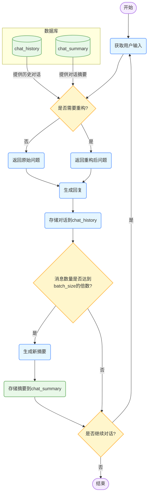

# 阶段三：基于LangGraph的端侧语言模型记忆增强与智能决策系统

## 项目概述
本项目是端侧语言模型记忆增强与智能决策机制研究的第三阶段实现，采用LangGraph框架构建了一个具有持久化记忆智能决策能力的对话系统。系统通过SQLite数据库实现长期记忆存储，利用LangGraph工作流框架实现查询重构和上下整合，并设计了完整的记忆能力评估机制。
    
## 核心特性

- **持久化记忆管理**：使用SQLite数据库存储对话历史和背景摘要
- **查询语义重构**：基于历史对话和背景摘要，智能重构用户查询
- **自适应背景压缩**：定期对历史对话进行总结，生成新的背景摘要
- **多模型协同工作**：支持本地模型和API模型混合使用
- **记忆能力量化评估**：提供完整的记忆能力测试和评分系统

## 系统架构

系统采用模块化设计，主要包括以下组件：

1. **对话管理模块**：处理用户输入，管理对话流程
2. **记忆存储模块**：管理对话历史和背景摘要的存储与检索
3. **查询重构模块**：基于历史信息重构用户查询
4. **响应生成模块**：生成AI回复
5. **评估系统**：测试和评估系统的记忆能力

### 工作流程图




## 功能模块详解

### 1. 记忆存储模块 (MessageStore类)

记忆存储模块负责管理对话历史和背景摘要的存储与检索，主要功能包括：

- **对话历史存储**：将用户输入和AI回复存储到SQLite数据库
- **背景摘要生成**：当对话历史达到一定数量时，自动生成新的背景摘要
- **历史记录检索**：根据需要检索最近的对话历史和最新的背景摘要

关键方法：
- `save_messages()`：保存对话记录
- `check_and_generate_summary()`：检查并生成新的背景摘要
- `get_latest_summary()`：获取最新的背景摘要
- `get_recent_messages()`：获取最近的对话记录

### 2. 持久化记忆类 (PersistentMemory类)

持久化记忆类是对记忆存储模块的封装，提供了更高级的接口，主要功能包括：

- **记忆初始化**：加载最近的对话历史
- **记忆更新**：添加新的对话记录并触发背景摘要生成

关键方法：
- `_load_recent_messages()`：加载最近的对话记录
- `add_messages()`：添加新的对话记录

### 3. 查询重构模块 (rephrase_query函数)

查询重构模块负责将用户的原始查询与历史上下文整合，生成更完整的查询，主要功能包括：

- **上下文整合**：将用户查询与历史对话和背景摘要整合
- **信息补充**：补充查询中缺失的上下文信息
- **查询优化**：优化查询结构，提高回答准确性

### 4. 响应生成模块 (generate_response函数)

响应生成模块负责生成AI回复，支持多种模型后端：

- **本地模型生成**：使用MiniCPM等本地部署的模型生成回复
- **API模型生成**：使用远程API服务生成回复
- **混合模式**：根据任务类型选择不同的模型生成回复

### 5. 工作流管理 (create_chat_graph函数)

工作流管理模块基于LangGraph框架，定义了对话系统的工作流程：

1. 接收用户输入
2. 重构查询
3. 生成回复
4. 存储对话历史
5. 检查并生成背景摘要

## 评估系统

系统包含完整的记忆能力评估机制，通过MemoryEvaluator类实现：

- **测试用例管理**：支持多种类型的记忆测试用例
- **自动化测试**：自动执行测试用例并收集结果
- **评分机制**：基于关键词匹配的评分系统
- **结果可视化**：生成详细的评估报告

测试类型包括：
- 基础信息记忆测试
- 复杂信息记忆测试
- 长期记忆衰减测试
- 推理能力测试

## 使用方法

### 1. 环境准备

```bash
# 安装依赖
pip install torch transformers langgraph langchain fastapi uvicorn rich requests
```

### 2. 启动聊天服务

```bash
# 启动基于MiniCPM的本地模型服务
python minicpm_chat.py

# 或启动基于API的服务
python myself_chat.py

# 或启动混合模式服务
python combined_chat.py
```

服务将在本地8000端口启动，可通过HTTP请求与服务交互。

### 3. 运行记忆能力评估

```bash
# 确保聊天服务已启动
python memory_evaluator.py
```

评估结果将显示在控制台并保存到score.txt文件中。

## 系统配置

系统主要配置参数：

- **batch_size**：触发背景摘要生成的对话数量阈值（默认为8）
- **model_path**：本地模型路径（默认为"openbmb/MiniCPM3-4B"）
- **API_URL**：远程API服务地址
- **max_new_tokens**：生成回复的最大token数（默认为1024）

## 未来工作

- 实现离线本地模型代替中转api
- 扩展评估系统，增加更多类型的测试用例
